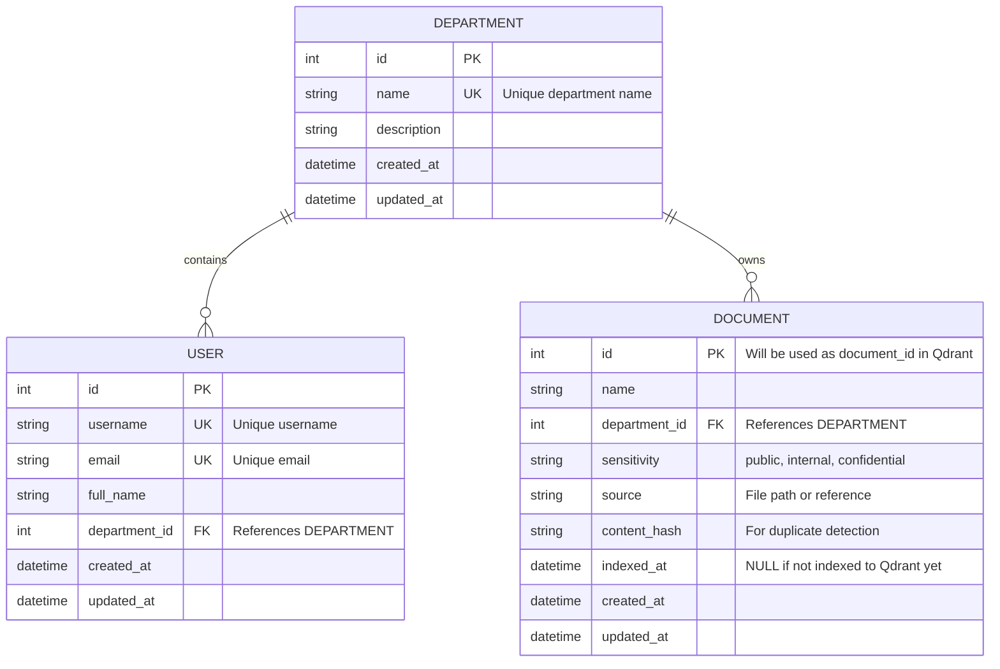

# Phase 3 — Data Model & Database Schema

## ✅ PHASE 3 COMPLETE

---

## Database Design

### Entity Relationship Diagram



---

## Data Responsibilities

### PostgreSQL (Implemented)
- **Departments**: Organizational units (engineering, sales, hr, general)
- **Users**: Employee identity and department membership
- **Documents**: Document metadata and ownership

### Qdrant (Future Phase)
- **Embeddings**: Vector representations of document chunks
- **Chunks**: Document chunk text
- **Metadata**: `document_id` (from PostgreSQL), `chunk_id`, `department`, `sensitivity`

**PostgreSQL-Qdrant Contract:**
- PostgreSQL `documents.id` → Qdrant payload `document_id`
- This connects relational metadata to vector search

---

## Database Schema

### Tables Created

#### `departments`
| Column | Type | Constraints |
|--------|------|-------------|
| id | Integer | Primary Key |
| name | String(100) | Unique, Not Null, Indexed |
| description | String(500) | Nullable |
| created_at | DateTime | Not Null |
| updated_at | DateTime | Not Null |

**Relationships:**
- One department → Many users (cascade delete)
- One department → Many documents (cascade delete)

#### `users`
| Column | Type | Constraints |
|--------|------|-------------|
| id | Integer | Primary Key |
| username | String(100) | Unique, Not Null, Indexed |
| email | String(255) | Unique, Not Null, Indexed |
| full_name | String(255) | Not Null |
| department_id | Integer | Foreign Key → departments.id, Not Null, Indexed |
| created_at | DateTime | Not Null |
| updated_at | DateTime | Not Null |

**Relationships:**
- Many users → One department

#### `documents`
| Column | Type | Constraints |
|--------|------|-------------|
| id | Integer | Primary Key (used as document_id in Qdrant) |
| name | String(255) | Not Null, Indexed |
| department_id | Integer | Foreign Key → departments.id, Not Null, Indexed |
| sensitivity | String(50) | Not Null, Default='internal' |
| source | Text | Nullable |
| content_hash | String(64) | Nullable, Indexed |
| indexed_at | DateTime | Nullable (NULL = not indexed yet) |
| created_at | DateTime | Not Null |
| updated_at | DateTime | Not Null |

**Relationships:**
- Many documents → One department

---

## Indexes

| Table | Column | Type | Rationale |
|-------|--------|------|-----------|
| departments | id | Primary Key | Standard PK index |
| departments | name | Unique Index | Fast department lookup by name |
| users | id | Primary Key | Standard PK index |
| users | username | Unique Index | Fast user lookup by username (auth) |
| users | email | Unique Index | Fast user lookup by email |
| users | department_id | Foreign Key Index | Fast filtering of users by department |
| documents | id | Primary Key | Standard PK index |
| documents | name | Index | Fast document search by name |
| documents | department_id | Foreign Key Index | **Critical**: Fast filtering by department (authorization) |
| documents | content_hash | Index | Fast duplicate detection during ingestion |

**Key Authorization Index:**
- `documents.department_id` index enables fast retrieval of documents by department
- This supports future queries like: `SELECT * FROM documents WHERE department_id = ?`
- While Qdrant handles vector search, this index supports metadata queries

---

## Models

### Department Model
**File:** `app/models/department.py`

**Purpose:** Organizational units that own documents and contain users

**Key Attributes:**
- `name`: Lowercase department name (e.g., "engineering")
- `users`: Relationship to User entities
- `documents`: Relationship to Document entities

**Validation:**
- Name must be unique
- Cascade delete to users and documents

### User Model
**File:** `app/models/user.py`

**Purpose:** Employee identity and department membership

**Key Attributes:**
- `username`: Unique username
- `email`: Unique email
- `department_id`: Foreign key defining authorization scope
- `department`: Relationship to Department entity

**Authorization Foundation:**
- User's department membership determines document access
- Backend will use `user.department_id` to construct Qdrant filters
- Client cannot override this relationship

**Note:** Password/authentication fields will be added in Phase 4

### Document Model
**File:** `app/models/document.py`

**Purpose:** Document metadata in the knowledge base

**Key Attributes:**
- `id`: Primary key (will be used as `document_id` in Qdrant)
- `department_id`: Defines access scope
- `sensitivity`: Classification (public/internal/confidential)
- `content_hash`: For duplicate detection
- `indexed_at`: NULL if not indexed to Qdrant yet

**Document Sensitivity Enum:**
```python
class DocumentSensitivity(str, Enum):
    PUBLIC = "public"          # Future: accessible to all
    INTERNAL = "internal"      # Standard internal documents
    CONFIDENTIAL = "confidential"  # Future: additional restrictions
```

**PostgreSQL-Qdrant Contract:**
- This model's `id` will be stored in Qdrant payloads as `document_id`
- Future chunks will reference this ID
- `indexed_at` tracks whether document has been indexed

---

## Repositories

Clean data access layer for each entity.

### DepartmentRepository
**File:** `app/repositories/department_repository.py`

**Methods:**
- `get_by_id(id)` - Get department by ID
- `get_by_name(name)` - Get department by name
- `get_all()` - Get all departments
- `create(name, description)` - Create department
- `update(id, description)` - Update department
- `delete(id)` - Delete department (cascade)

### UserRepository
**File:** `app/repositories/user_repository.py`

**Methods:**
- `get_by_id(id)` - Get user by ID
- `get_by_username(username)` - Get user by username
- `get_by_email(email)` - Get user by email
- `get_by_department(department_id)` - Get users in department
- `get_all()` - Get all users
- `create(username, email, full_name, department_id)` - Create user
- `update(id, ...)` - Update user
- `delete(id)` - Delete user

### DocumentRepository
**File:** `app/repositories/document_repository.py`

**Methods:**
- `get_by_id(id)` - Get document by ID
- `get_by_department(department_id)` - Get documents in department
- `get_by_content_hash(hash)` - Find duplicate
- `get_indexed()` - Get indexed documents
- `get_not_indexed()` - Get documents not yet indexed
- `create(name, department_id, ...)` - Create document
- `update(id, ...)` - Update document
- `mark_as_indexed(id)` - Mark as indexed to Qdrant
- `delete(id)` - Delete document

**Note:** Repositories encapsulate database logic and will be used by future service layers

---

## Migrations

**Tool:** Alembic

**Initial Migration:** `778ae405bfe0_initial_schema_departments_users_documents.py`

**Migration Commands:**
```bash
# Run migrations
alembic upgrade head

# View migration history
alembic history

# Rollback
alembic downgrade -1

# Reset database
alembic downgrade base
alembic upgrade head
```

**Configuration:**
- `alembic/env.py` - Configured to use application settings and models
- `alembic.ini` - Database URL from environment variables
- Migrations stored in `alembic/versions/`

---

## Seed Data

**File:** `app/db/seed.py`

**Purpose:** Create deterministic development/test data

**Departments:**
- engineering
- sales
- hr
- general

**Users:**
| Username | Email | Department | Full Name |
|----------|-------|------------|-----------|
| alice | alice@company.com | engineering | Alice Johnson |
| bob | bob@company.com | sales | Bob Smith |
| charlie | charlie@company.com | hr | Charlie Williams |

**Documents:** 12 documents across departments

**Engineering:**
- Deployment Guidelines
- Coding Standards
- Architecture Guide

**Sales:**
- Pricing Policy (confidential)
- Discount Policy (confidential)
- Sales Playbook

**HR:**
- Leave Policy
- Employee Benefits
- Performance Review Guidelines (confidential)

**General:**
- Company Overview (public)
- Security Policy
- Code of Conduct (public)

**Seeding Commands:**
```bash
# Run seed
python scripts/manage_db.py seed

# Or directly
python -m app.db.seed
```

**Idempotent:** Safe to run multiple times (skips existing records)

---

## Database Management CLI

**File:** `scripts/manage_db.py`

**Commands:**
```bash
# Run migrations
python scripts/manage_db.py migrate

# Seed database
python scripts/manage_db.py seed

# Reset database (downgrade + upgrade)
python scripts/manage_db.py reset
```

---

## Files Created/Modified

### Models (4 files)
1. `app/models/__init__.py` - Models package
2. `app/models/department.py` - Department model
3. `app/models/user.py` - User model
4. `app/models/document.py` - Document model + DocumentSensitivity enum

### Repositories (4 files)
5. `app/repositories/__init__.py` - Repositories package
6. `app/repositories/department_repository.py` - Department data access
7. `app/repositories/user_repository.py` - User data access
8. `app/repositories/document_repository.py` - Document data access

### Database (2 files)
9. `app/db/seed.py` - Seed data script
10. `app/db/session.py` - Updated to import models

### Migrations (3 files)
11. `alembic/env.py` - Configured for application
12. `alembic.ini` - Alembic configuration
13. `alembic/versions/778ae405bfe0_initial_schema_departments_users_.py` - Initial migration

### Scripts (1 file)
14. `scripts/manage_db.py` - Database management CLI

### Tests (3 files)
15. `tests/test_models.py` - Model tests
16. `tests/test_repositories.py` - Repository tests
17. `tests/test_seed.py` - Seed tests

### Documentation (1 file)
18. `PHASE_3_COMPLETE.md` - This file

**Total: 18 files created/modified**

---

## Test Coverage

### Model Tests (`tests/test_models.py`)
- ✅ Create department
- ✅ Department name uniqueness
- ✅ Create user
- ✅ User email uniqueness
- ✅ User requires valid department (foreign key)
- ✅ Create document
- ✅ Document requires valid department (foreign key)
- ✅ Department-user relationship
- ✅ Department-document relationship
- ✅ Cascade delete

### Repository Tests (`tests/test_repositories.py`)
- ✅ Department repository CRUD operations
- ✅ User repository CRUD operations
- ✅ Document repository CRUD operations
- ✅ Get users by department
- ✅ Get documents by department
- ✅ Mark document as indexed
- ✅ Get indexed/not-indexed documents

### Seed Tests (`tests/test_seed.py`)
- ✅ Seed creates expected data
- ✅ Seed is idempotent (can run multiple times)

---

## Design Decisions

### 1. Integer Primary Keys

**Decision:** Use Integer auto-increment IDs instead of UUIDs

**Rationale:**
- **Performance**: Faster indexing and joins
- **Simplicity**: Human-readable IDs for debugging
- **Compatibility**: Works well with both PostgreSQL and Qdrant
- **Future-proof**: Can migrate to UUIDs later if needed for distributed systems

**Contract:** `documents.id` will be used as `document_id` in Qdrant payloads

### 2. Department-Based Authorization

**Decision:** Users belong to ONE department currently

**Rationale:**
- Meets assignment requirements (Alice → Engineering, Bob → Sales, Charlie → HR)
- Simple and clear for POC
- Schema supports future multi-department membership (add junction table later)

**Extensibility:**
```sql
-- Future: Many-to-many relationship
CREATE TABLE user_departments (
    user_id INT REFERENCES users(id),
    department_id INT REFERENCES departments(id),
    PRIMARY KEY (user_id, department_id)
);
```

### 3. Document Sensitivity as String

**Decision:** Store sensitivity as string enum, not separate table

**Rationale:**
- Only 3 values (public, internal, confidential)
- Unlikely to change frequently
- Python enum provides type safety
- Simpler than foreign key to sensitivity table

**Validation:** Enum enforced in application layer

### 4. content_hash for Duplicate Detection

**Decision:** Include `content_hash` field for future use

**Rationale:**
- Enables duplicate detection during ingestion
- Supports re-indexing (detect if document changed)
- Indexed for fast lookup
- Optional (nullable) for flexibility

**Future use:** Hash document content before indexing to Qdrant

### 5. indexed_at Timestamp

**Decision:** Track when document was indexed to Qdrant

**Rationale:**
- Null = not indexed yet
- Non-null = indexed (can filter for re-indexing)
- Audit trail for indexing pipeline
- Supports incremental indexing

**Usage:**
```python
# Get documents needing indexing
not_indexed = doc_repo.get_not_indexed()
```

### 6. Cascade Delete

**Decision:** Cascade delete from department to users and documents

**Rationale:**
- Orphaned users/documents don't make sense
- Simplifies cleanup
- Clear ownership hierarchy
- Appropriate for development/POC

**Production consideration:** May want to soft-delete instead

### 7. Repositories Pattern

**Decision:** Introduce repository layer now

**Rationale:**
- Encapsulates database logic
- Easier to test business logic later
- Cleaner API routes (won't have raw SQL)
- Standard pattern in enterprise applications
- **Not overengineered**: Simple CRUD methods only

### 8. Lowercase Department Names

**Decision:** Store department names in lowercase

**Rationale:**
- Consistency (avoid "Engineering" vs "engineering")
- Easier filtering and comparisons
- Matches typical database conventions

**Implementation:** `.lower()` in repository create method

---

## Authorization Foundation

**Current Implementation:**
```
User
  ↓ department_id (trusted FK)
Department
  ↓ id
Document.department_id
```

**Future Authorization Flow (Phase 4+):**
```
1. User authenticates → JWT with user_id
2. Backend loads user from PostgreSQL
3. Backend retrieves user.department_id
4. Backend constructs Qdrant filter:
   filter = {"must": [{"key": "department", "match": {"value": department_name}}]}
5. Qdrant search returns ONLY authorized chunks
6. Sources include ONLY authorized documents
```

**Security Guarantee:**
- User's department comes from PostgreSQL, NOT from JWT or request
- Client cannot manipulate authorization
- Department relationship is enforced by database foreign key

---

## PostgreSQL-Qdrant Contract

### Document ID Mapping

**PostgreSQL:**
```python
document = Document(
    id=1,  # Auto-generated
    name="Deployment Guidelines",
    department_id=1,
    ...
)
```

**Future Qdrant Payload:**
```json
{
  "document_id": 1,           ← From PostgreSQL documents.id
  "chunk_id": "1-chunk-0",
  "department": "engineering", ← From PostgreSQL departments.name
  "sensitivity": "internal",   ← From PostgreSQL documents.sensitivity
  "document_name": "Deployment Guidelines",
  "chunk_text": "All deployments must..."
}
```

**Relationship:**
- `documents.id` → Qdrant `document_id`
- `departments.name` → Qdrant `department` (for ACL filtering)
- `documents.sensitivity` → Qdrant `sensitivity` (for future policy)

---

## What's NOT Implemented (By Design)

As per Phase 3 scope:
- ❌ JWT authentication (Phase 4)
- ❌ Login/logout (Phase 4)
- ❌ Authorization middleware (Phase 4)
- ❌ Password hashing (Phase 4)
- ❌ RAG pipeline (Phases 5-8)
- ❌ Document ingestion (Phase 5)
- ❌ Embeddings (Phase 6)
- ❌ Qdrant indexing (Phase 6)
- ❌ Vector search (Phase 7)
- ❌ LLM integration (Phase 8)

---

## Verification Checklist

- ✅ Department model created
- ✅ User model created
- ✅ Document model created
- ✅ Relationships defined (department → users, department → documents)
- ✅ Foreign key constraints
- ✅ Unique constraints (department.name, user.username, user.email)
- ✅ Indexes (department_id, email, username, content_hash)
- ✅ Alembic migrations configured
- ✅ Initial migration created
- ✅ Repositories implemented
- ✅ Seed data script created
- ✅ Database management CLI created
- ✅ Model tests passing
- ✅ Repository tests passing
- ✅ Seed tests passing
- ✅ Documentation updated

---

## Next Phase Preview

**Phase 4: Authentication & Authorization**

Will implement:
- Password hashing (bcrypt)
- JWT token generation and validation
- Login endpoint (`POST /api/auth/login`)
- Authentication middleware
- Authorization service (loads user department)
- Protected route decorator
- User fixtures with passwords
- Authentication tests

**Prerequisites:**
- ✅ Phase 3 complete (users exist in database)
- ✅ User model has department_id
- ✅ Repositories ready to use

---

## Phase 3 Status: ✅ COMPLETE

**Database schema is designed, migrated, seeded, tested, and ready for Phase 4.**

All scope items completed:
- ✅ Data model designed
- ✅ SQLAlchemy models created
- ✅ Relationships defined
- ✅ Database constraints implemented
- ✅ Indexes added
- ✅ Alembic migrations configured
- ✅ Initial migration created
- ✅ Seed data implemented
- ✅ Repositories created
- ✅ Tests passing
- ✅ Documentation complete
- ✅ PostgreSQL-Qdrant contract defined
- ✅ Authorization foundation established

---

**WAITING FOR YOUR NEXT INSTRUCTION.**

Do not proceed to Phase 4 until instructed.
