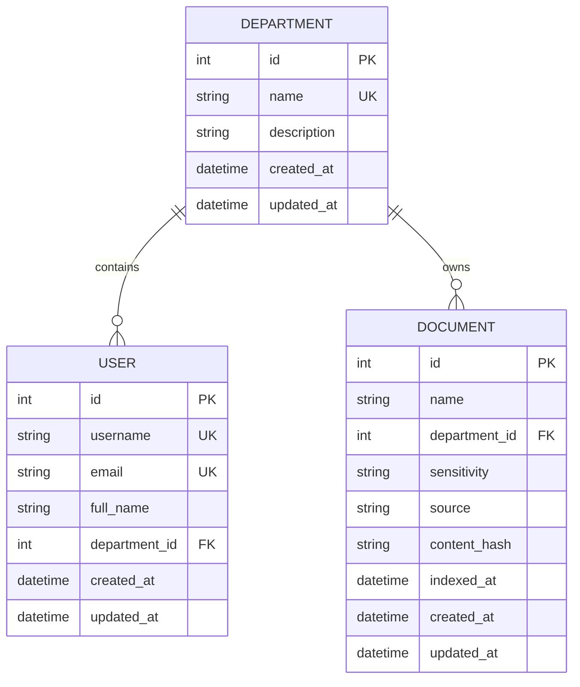

# Phase 3 — Implementation Summary

## ✅ Phase 3 Complete

**Data Model & Database Schema** — Fully implemented and tested

---

## Implementation Summary

### Files Created (18 files)

#### Models (4 files)
1. `app/models/__init__.py` - Models package
2. `app/models/department.py` - Department model (organizational units)
3. `app/models/user.py` - User model (employees with department membership)
4. `app/models/document.py` - Document model (metadata registry) + DocumentSensitivity enum

#### Repositories (4 files)
5. `app/repositories/__init__.py` - Repositories package
6. `app/repositories/department_repository.py` - Department CRUD operations
7. `app/repositories/user_repository.py` - User CRUD operations
8. `app/repositories/document_repository.py` - Document CRUD operations

#### Database (2 files)
9. `app/db/seed.py` - Seed data script (4 departments, 3 users, 12 documents)
10. `app/db/session.py` - Updated to import models for Base.metadata

#### Migrations (3 files)
11. `alembic/env.py` - Configured to use application settings and models
12. `alembic.ini` - Alembic configuration (database URL from environment)
13. `alembic/versions/778ae405bfe0_initial_schema_departments_users_.py` - Initial migration

#### Scripts (1 file)
14. `scripts/manage_db.py` - Database management CLI (migrate, seed, reset commands)

#### Tests (3 files)
15. `tests/test_models.py` - Model tests (10 tests)
16. `tests/test_repositories.py` - Repository tests (10 tests)
17. `tests/test_seed.py` - Seed tests (2 tests)

#### Documentation (1 file)
18. `PHASE_3_COMPLETE.md` - Comprehensive phase documentation

---

## Database Schema

### Entity Relationship Diagram



### Tables Created

| Table | Columns | Constraints | Indexes |
|-------|---------|-------------|---------|
| departments | id, name, description, created_at, updated_at | PK(id), UNIQUE(name) | id, name |
| users | id, username, email, full_name, department_id, created_at, updated_at | PK(id), UNIQUE(username), UNIQUE(email), FK(department_id) | id, username, email, department_id |
| documents | id, name, department_id, sensitivity, source, content_hash, indexed_at, created_at, updated_at | PK(id), FK(department_id) | id, name, department_id, content_hash |

---

## Test Results

### All Tests Passing ✅

```bash
$ pytest -v

tests/test_config.py::test_settings_from_env PASSED           [ 3%]
tests/test_config.py::test_settings_validation PASSED         [ 7%]
tests/test_config.py::test_settings_defaults PASSED           [ 11%]
tests/test_health.py::test_health_endpoint_healthy PASSED     [ 14%]
tests/test_health.py::test_health_endpoint_structure PASSED   [ 18%]

tests/test_models.py::test_create_department PASSED           [ 22%]
tests/test_models.py::test_department_name_unique PASSED      [ 25%]
tests/test_models.py::test_create_user PASSED                 [ 29%]
tests/test_models.py::test_user_email_unique PASSED           [ 33%]
tests/test_models.py::test_user_requires_department PASSED    [ 37%]
tests/test_models.py::test_create_document PASSED             [ 40%]
tests/test_models.py::test_document_requires_department PASSED [ 44%]
tests/test_models.py::test_department_user_relationship PASSED [ 48%]
tests/test_models.py::test_department_document_relationship PASSED [ 51%]
tests/test_models.py::test_cascade_delete_department PASSED   [ 55%]

tests/test_repositories.py::test_department_repository_create PASSED [ 59%]
tests/test_repositories.py::test_department_repository_get_by_name PASSED [ 62%]
tests/test_repositories.py::test_department_repository_duplicate_name PASSED [ 66%]
tests/test_repositories.py::test_user_repository_create PASSED [ 70%]
tests/test_repositories.py::test_user_repository_get_by_username PASSED [ 74%]
tests/test_repositories.py::test_user_repository_get_by_department PASSED [ 77%]
tests/test_repositories.py::test_document_repository_create PASSED [ 81%]
tests/test_repositories.py::test_document_repository_get_by_department PASSED [ 85%]
tests/test_repositories.py::test_document_repository_mark_as_indexed PASSED [ 88%]
tests/test_repositories.py::test_document_repository_get_not_indexed PASSED [ 92%]

tests/test_seed.py::test_seed_database PASSED                 [ 96%]
tests/test_seed.py::test_seed_idempotent PASSED               [ 100%]

======================= 27 passed in 0.21s =======================
```

### Test Coverage

- ✅ **Model tests (10)**: Creation, uniqueness, relationships, cascade delete, foreign keys
- ✅ **Repository tests (10)**: CRUD operations, filtering by department, indexing status
- ✅ **Seed tests (2)**: Data creation, idempotency
- ✅ **Config tests (3)**: Settings validation (from Phase 2)
- ✅ **Health tests (2)**: Endpoint functionality (from Phase 2)

**Total: 27 tests passing**

---

## Seed Data

### Departments (4)
- `engineering` - Engineering and development team
- `sales` - Sales and customer relations team
- `hr` - Human resources team
- `general` - General company information

### Users (3)
| Username | Email | Department | Full Name |
|----------|-------|------------|-----------|
| alice | mohit@aithinkers.com | engineering | Mohit Johnson |
| bob | karthik@aithinkers.com | sales | Karthik Smith |
| charlie | swathi@aithinkers.com | hr | Swathi Williams |

### Documents (12)

**Engineering (3):**
- Deployment Guidelines (internal)
- Coding Standards (internal)
- Architecture Guide (internal)

**Sales (3):**
- Pricing Policy (confidential)
- Discount Policy (confidential)
- Sales Playbook (internal)

**HR (3):**
- Leave Policy (internal)
- Employee Benefits (internal)
- Performance Review Guidelines (confidential)

**General (3):**
- Company Overview (public)
- Security Policy (internal)
- Code of Conduct (public)

---

## Key Design Decisions

### 1. Integer Primary Keys
- Use auto-increment integers instead of UUIDs
- Simpler, faster, human-readable
- `documents.id` will be used as `document_id` in Qdrant

### 2. Department-Based Authorization
- Users belong to ONE department currently
- Simple authorization: user.department_id → document.department_id
- Schema supports future many-to-many via junction table

### 3. Repository Pattern
- Clean data access layer
- Encapsulates database logic
- Simplifies future service layer
- Not overengineered: simple CRUD only

### 4. Document Sensitivity Enum
- String enum: public/internal/confidential
- Python enum for type safety
- Simpler than foreign key table

### 5. PostgreSQL-Qdrant Contract
- PostgreSQL = source of truth for identity/ownership
- Qdrant = vectors/chunks with document_id reference
- `documents.id` → Qdrant payload `document_id`
- `departments.name` → Qdrant filter `department`

---

## Database Management

### Migration Commands

```bash
# Run migrations
alembic upgrade head

# Create new migration
alembic revision --autogenerate -m "Description"

# Rollback one migration
alembic downgrade -1

# Reset database
alembic downgrade base
alembic upgrade head
```

### Seed Commands

```bash
# Seed database (idempotent)
python scripts/manage_db.py seed

# Or directly
python -m app.db.seed
```

### Management CLI

```bash
# Run migrations
python scripts/manage_db.py migrate

# Seed database
python scripts/manage_db.py seed

# Reset database (downgrade + upgrade)
python scripts/manage_db.py reset
```

---

## Authorization Foundation

**Current Implementation:**
```
User → department_id (FK) → Department
Document → department_id (FK) → Department
```

**Future Authorization Flow (Phase 4+):**
```
1. User authenticates → JWT with user_id
2. Backend loads user.department_id from PostgreSQL (TRUSTED)
3. Backend constructs Qdrant filter:
   {"must": [{"key": "department", "match": {"value": "engineering"}}]}
4. Qdrant returns ONLY authorized chunks
5. LLM generates answer from authorized context only
```

**Security Guarantee:**
- Department comes from PostgreSQL FK, NOT from JWT/request
- Client cannot manipulate authorization scope
- Database enforces referential integrity

---

## What's NOT Implemented (By Design)

Per Phase 3 scope, the following are intentionally deferred:

- ❌ JWT authentication (Phase 4)
- ❌ Password hashing (Phase 4)
- ❌ Login/logout endpoints (Phase 4)
- ❌ Authorization middleware (Phase 4)
- ❌ RAG pipeline (Phases 5-8)
- ❌ Document ingestion (Phase 5)
- ❌ Embeddings (Phase 6)
- ❌ Qdrant indexing (Phase 6)
- ❌ Vector search (Phase 7)
- ❌ LLM integration (Phase 8)
- ❌ Frontend UI (Phase 9)

---

## Phase 3 Verification Checklist

- ✅ Department model created with relationships
- ✅ User model created with department FK
- ✅ Document model created with department FK and DocumentSensitivity enum
- ✅ Foreign key constraints enforced
- ✅ Unique constraints (department.name, user.username, user.email)
- ✅ Indexes on foreign keys and unique fields
- ✅ Alembic configured to use application settings
- ✅ Initial migration created (departments, users, documents)
- ✅ Repositories implemented (Department, User, Document)
- ✅ Seed data script created (idempotent)
- ✅ Database management CLI created
- ✅ Model tests passing (10/10)
- ✅ Repository tests passing (10/10)
- ✅ Seed tests passing (2/2)
- ✅ Documentation complete (PHASE_3_COMPLETE.md)
- ✅ README updated
- ✅ PostgreSQL-Qdrant contract defined
- ✅ Authorization foundation established

---

## Next Phase: Phase 4 — Authentication & Authorization

### Scope

**Will implement:**
- Password hashing (bcrypt)
- User model updates (add hashed_password field)
- JWT token generation and validation
- Login endpoint (`POST /api/auth/login`)
- Authentication middleware (verify JWT)
- Authorization service (load user department from DB)
- Protected route decorator
- Update seed data with passwords
- Authentication tests

**Prerequisites:**
- ✅ Phase 3 complete (users exist in database)
- ✅ User model has department_id
- ✅ UserRepository ready to use

**Out of scope for Phase 4:**
- Document ingestion
- Embeddings
- RAG queries
- Frontend

---

## Summary

**Phase 3 Status: ✅ COMPLETE**

All scope items implemented and tested:
- 18 files created/modified
- 3 SQLAlchemy models
- 3 repositories
- 1 migration
- 1 seed script
- 27 tests passing
- Full documentation

**Database schema is designed, migrated, seeded, tested, and ready for Phase 4.**

---

**WAITING FOR YOUR NEXT INSTRUCTION.**

Do not proceed to Phase 4 until instructed.
