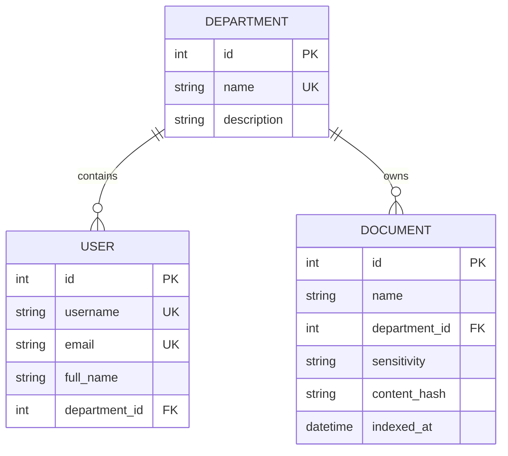

# 🎉 Phase 3 COMPLETE — Data Model & Database Schema

## Quick Summary

✅ **All 27 tests passing**
✅ **18 files created/modified**
✅ **3 SQLAlchemy models implemented**
✅ **3 repositories created**
✅ **Alembic migrations configured**
✅ **Seed data script (4 depts, 3 users, 12 docs)**
✅ **Full documentation**

---

## What Was Implemented

### Database Models
- **Department**: Organizational units (engineering, sales, hr, general)
- **User**: Employees with department membership (alice, bob, charlie)
- **Document**: Document metadata with department ownership

### Repositories
- **DepartmentRepository**: CRUD operations for departments
- **UserRepository**: User management with department filtering
- **DocumentRepository**: Document management with indexing status tracking

### Database Infrastructure
- **Alembic migrations**: Full migration system configured
- **Seed data**: Idempotent seed script with test data
- **Management CLI**: Commands for migrate, seed, reset

### Tests
```
27 tests passing:
├── 10 model tests (relationships, constraints, cascade delete)
├── 10 repository tests (CRUD, filtering, indexing)
├── 2 seed tests (creation, idempotency)
├── 3 config tests (from Phase 2)
└── 2 health tests (from Phase 2)
```

---

## Database Schema



---

## Key Files Created

### Models
1. `app/models/department.py` - Department model
2. `app/models/user.py` - User model
3. `app/models/document.py` - Document model + DocumentSensitivity enum

### Repositories
4. `app/repositories/department_repository.py`
5. `app/repositories/user_repository.py`
6. `app/repositories/document_repository.py`

### Database
7. `app/db/seed.py` - Seed data script
8. `alembic/versions/778ae405bfe0_*.py` - Initial migration

### Scripts & Tests
9. `scripts/manage_db.py` - Database management CLI
10. `tests/test_models.py` - Model tests (10 tests)
11. `tests/test_repositories.py` - Repository tests (10 tests)
12. `tests/test_seed.py` - Seed tests (2 tests)

---

## Quick Commands

### Run Migrations
```bash
cd backend
alembic upgrade head
```

### Seed Database
```bash
cd backend
python scripts/manage_db.py seed
```

### Run Tests
```bash
cd backend
source venv/bin/activate
pytest -v
```

---

## Authorization Foundation

**Ready for Phase 4:**
```
User.department_id (FK) → Department.id
Document.department_id (FK) → Department.id
```

**Future authorization flow:**
1. User authenticates → JWT with `user_id`
2. Backend loads `user.department_id` from PostgreSQL (TRUSTED)
3. Backend filters Qdrant: `{"department": "engineering"}`
4. User sees ONLY their department's documents

---

## PostgreSQL-Qdrant Contract

**PostgreSQL** (implemented):
- `documents.id` → Used as `document_id` in Qdrant
- `departments.name` → Used for ACL filtering
- `documents.sensitivity` → Used for future policy

**Qdrant** (future phase):
```json
{
  "document_id": 1,
  "department": "engineering",
  "sensitivity": "internal",
  "chunk_text": "..."
}
```

---

## Seed Data

**Departments:** engineering, sales, hr, general

**Users:**
- alice@company.com (engineering)
- bob@company.com (sales)
- charlie@company.com (hr)

**Documents:** 12 documents across all departments
- Engineering: 3 docs (deployment, coding standards, architecture)
- Sales: 3 docs (pricing, discounts, playbook)
- HR: 3 docs (leave policy, benefits, reviews)
- General: 3 docs (overview, security, conduct)

---

## What's NOT Implemented

By design (deferred to future phases):
- ❌ Authentication (Phase 4)
- ❌ JWT tokens (Phase 4)
- ❌ Password hashing (Phase 4)
- ❌ Document ingestion (Phase 5)
- ❌ Embeddings (Phase 6)
- ❌ Vector search (Phase 7)
- ❌ LLM integration (Phase 8)

---

## Next Phase Preview

**Phase 4: Authentication & Authorization**

Will add:
- Password hashing (bcrypt)
- Login endpoint (`POST /api/auth/login`)
- JWT token generation
- Authentication middleware
- Authorization service (load user department)
- Protected routes

---

## ✅ Phase 3 Complete

**Database schema is designed, migrated, seeded, tested, and documented.**

**Ready for Phase 4!**

---

See [PHASE_3_COMPLETE.md](PHASE_3_COMPLETE.md) for comprehensive documentation.
